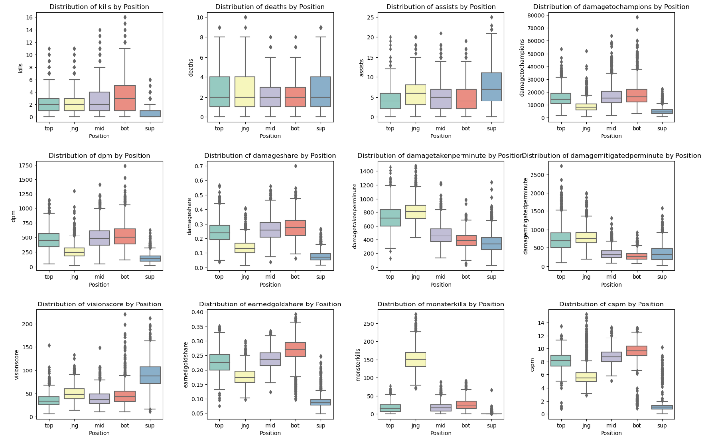
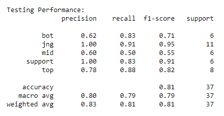
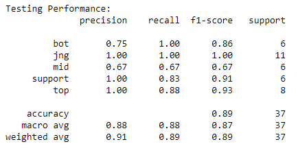
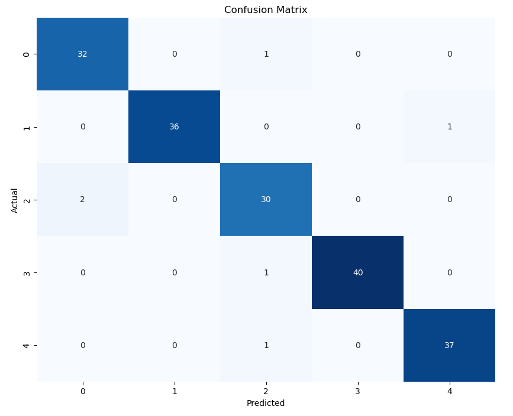
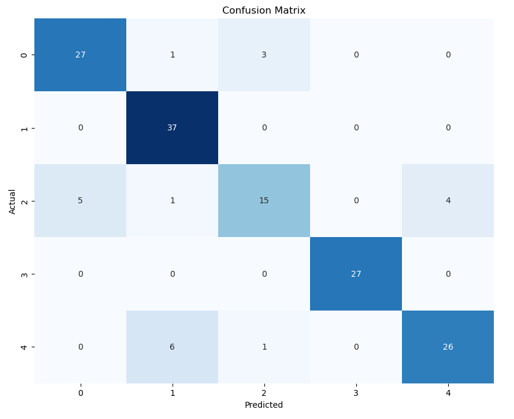

# Predicting the Roles in League of Legends
By Jeremy Quinto

Exploratory Data Analysis for this dataset can be found [here](https://jpquinto.github.io/League-Of-Legends-Skill-Diffs-Analysis/)

### Overview

In League of Legends, there are 5 roles that differ greatly in playstyle: top lane, mid lane, bottom lane, support, and jungle. Aside from spending most of their game in different spots of the map, the playable champions in each role are very different in terms of utility.

### Question
We will pose the following question: given a player's statistics for the game, can we determine what role they were playing?

This problem is a multiclass classification problem. We'll be predicting the `position` variable using features that we will find. At the end, we end up looking at evaluation metrics such as precision, recall, and f1-score to see how well our model does, as it gave a good summary of the efficiency of our model. 

Just like our exploratory data analysis project, we will be looking at data from the LCS (League of Legends Championship Series) 2022 season, as well as the LCK (League of Legends Champions Korea) 2022 season. We created a dataframe called `players` that has a row for each player in the LCS/LCK for the 2022 season and their average statistics in categories such as kills, deaths, assists, vision score, and many more. Most importantly, each player also had a column for what `position` they play: top, mid, jng (jungle), bot, or sup (support). 

```
# Retrieving Data
lol = pd.read_csv('lol.csv', low_memory=False)
# We are only going to be looking at the LCS and LCK
lcslck = lol[lol['league'].isin(['LCS', 'LCK'])]

lcslck.dropna(subset=['playername'], inplace=True)
lcslck.head()
```

### Baseline Model

We started by creating a baseline model using just 2 features. First, we created boxplots of the distributions of different candidate features, separated by role. For this model, we ended up using the features: `cspm` and `damagetakenperminute`, since their distributions between the groups looked the most different. 




We performed a one hot encoding on the `position` column, making it an ordinal variable. `cspm` is a quantitative continuous feature, and `damagetakenperminute` is also a quantitative continuous feature. We did not adjust anything with those two columns. 

Our model ended up performing well, with the macro averages for precision, recall, and f1-score coming out to about 80%, while the weighted averages were a couple points higher, all for the testing data. This means it was about 80% accurate in predicting the roles of the players in the testing data, and I thought that was a good place to start for our baseline model.




### Final Model
Next, we created a final model that looked to improve on the baseline model. I wanted to include 2 new features, and we had a lot of candidates for new ones. After looking at the distributions of the features separated by groups, I decided it would be best to perform Recursive Feature Elimination to get an idea for the best subset of features. This was a quick step but it was worth it in the end. 

After performing RFE, which involved a `RandomForestClassifier` model, we got the following features: `damagemitigatedperminute`, `earnedgoldshare`, `monsterkills`, and `cspm`. This was very interesting, as when someone thinks stats in a video game, one would immediately think of KDA (Kills/Deaths/Assists). That's where my mind went at first, and I also thought `visionscore` might show up in the best features. 

However, looking at the distribution plots from earlier, these 4 features do make sense, as there is a lot of variation between the groups. The intuition was that statistics, such as `monsterkills` (where the jungle role dominates in), that have a wide variation in the distributions between roles would lead to a more accurate model. For example, the difference between the mean `cspm` for the bot role was very different than the average for the support role, which makes sense as you want your bot player to get as much gold as possible. So I tried these statistics in the final model. Note that all of these features are proportions (and continuous), as they are per game averages. 

For the final model, we created an `sklearn` `Pipeline`. We applied a standard scaler and a power transformer for the numerical features (all of them), and a one hot encoder for the `position` column. 

The algorithm involved a `RandomForestClassifier()`, which involves creating many many decision trees. When creating the decision trees, which help us predict what role a player is playing, we have hyperparameters, which are variables aside from the features that we get to fine tune ourselves. In this case, these hyperparameters were:
- `model__n_estimators`: this determines the number of decision trees in the random forest ensemble. Possible values were 100, 200, 300, and 400
- `model__min_samples_split`: this specifies the number of samples required to split an internal node in a decision tree. Possible values were 2, 5, 10, and 15. 
- `model__max_depth`: this defines the maximum depth of each decision tree. Possible values were 5, 10, and 15.
We then used `GridSearchSV` to iteratively find the best combination of hyperparameters. After fitting the model, our best parameters ended up being:
- `max depth` = 10
- `min samples split` = 2
- `model n estimators` = 100

`GridSearchSV` gave us our best model, and we used it to predict the testing data. Remember that our baseline model had a weighted average of 83% on precision, 81% on recall, and 81% for f1-score on the testing data. Our final model boasted a weighted average of 91% on precision, 89% on recall, and 89% on f1-score on the same testing data. This means our final model performed around 10% better than our baseline model when it came to predicting the roles of players in the LCS/LCK. While not perfect, it was a major improvement over the baseline model, and it was able to perfectly predict every jungle, support, and top player in the testing data, with just a few misses in the bot and mid roles. 




Below is a confusion matrix of our model on the entire player dataset. Of all the players, our model only predicted 6 of the 181 *incorrectly*. That's pretty good, and an improvement from our baseline model.




### Fairness Analysis
Next, we performed fairness analysis on our model to see if it performs worse for players that arne't the LCS and LCK. We created a dataframe called `sl`, which has played from the `SuperLiga` 2022 season. This is about the same amount of players as the LCS and LCK combined, so our groups are equal.

Here, we ask the question: does our model perform worse on Group X than it does on Group Y? In this case, Group X is the SuperLiga, and Group Y is the LCS/LCK. 

We performeda **permutation test** with a significance level of $p=0.05$ to see if our model is fair. We used f1-score as our evaluation metric, and compare the leagues SL vs LCS/LCK. 

**Null Hypothesis**: Our model is fair, its F1-score for the SuperLiga and the LCS/LCK are roughly the same, and any differences are due to random chance.

**Alternative Hypothesis**: Our model is unfair. Its F1-score for SuperLiga is lower than its precision for the LCS/LCK. 

The permutation test returned a p-value of $0.000999$, which is *very* small. This suggests that we should reject the null hypothesis, and **suggests** that there is *statistically significant evidence* that our model is unfair.

Below is a confusion matrix of our model on the `sl` dataframe:



As you can see, it did not do quite as well as it did with the LCS/LCK.

However, as our model was built with the LCS/LCK in mind, and the leagues may differ a bit, this could have been expected. One could redo the process of creating the final model by training it on all the leagues, and that may lead to a more fair model in terms of predicting roles between leagues. But the goal of my work was to work on a model for the LCS/LCK, and unfortunately the model may not be as fair when it comes to other leagues.

### Conclusion
We were able to create an effective model for predicting the role of a player given their damage mitigated per minute, their cs per minute, their earned gold share, and their monster kills. We started with a baseline model which involved linear regression on two features, and then upgraded that model to use 4 features, and include decision trees and GridSearch to fine tune the parameters. Unfortunately, as we wanted to focus on just the LCS/LCK, our permutation test suggested that our model was not fair when it came to predicting other leagues. Next time, one could train the final model on the entire league instead of just the LCS/LCK in order to get a more fair model across the leagues.

Thank you for reading!


Note: I did not have a partner for this project, I just used 'we' a lot.